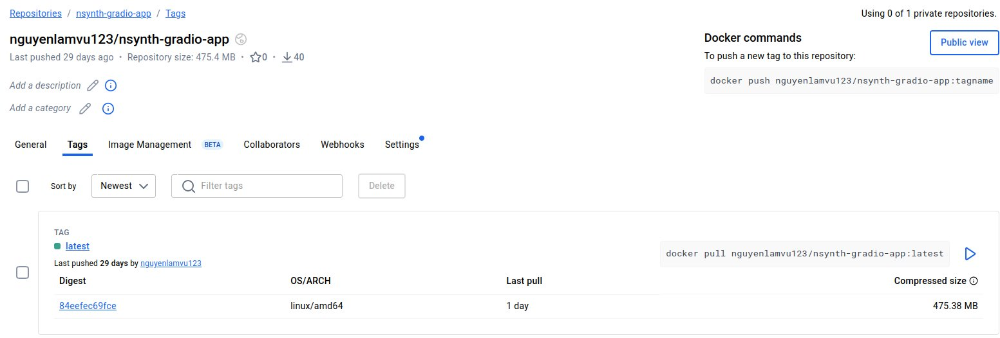

# docker pull nguyenlamvu123/nsynth-gradio-app:latest

## sudo docker compose up --build
##sudo docker run -it -p 8501:8501 -v ./SavedModels:/app/SavedModels nguyenlamvu123/nsynth-gradio-app:latest /bin/bash
- python3 -m unittest untes.py
- python3 grad.py
