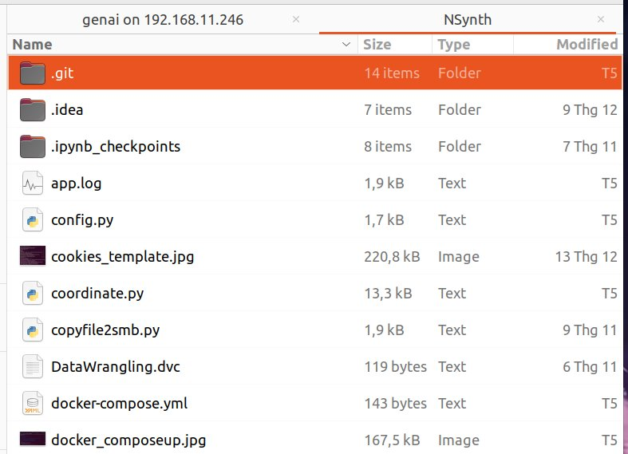

	2025-12-25 21:00:26,051 [INFO] run unittest!
	2025-12-25 21:00:28,273 [INFO] trích xuất đặc trưng hoàn thành!
	2025-12-25 21:00:28,311 [INFO] run unittest!
	2025-12-25 21:00:28,670 [INFO] trích xuất đặc trưng hoàn thành!
	2025-12-25 21:00:28,688 [WARNING] dự đoán trục trặc!
	2025-12-25 21:05:07,317 [INFO] run unittest!
	2025-12-25 21:05:09,214 [INFO] trích xuất đặc trưng hoàn thành!
	2025-12-25 21:05:09,251 [INFO] run unittest!
	2025-12-25 21:05:09,612 [INFO] trích xuất đặc trưng hoàn thành!
	2025-12-25 21:05:09,621 [WARNING] dự đoán trục trặc!
	2025-12-25 23:44:30,710 [INFO] HTTP Request: HEAD https://huggingface.co/api/telemetry/https%3A/api.gradio.app/gradio-initiated-analytics "HTTP/1.1 200 OK"
	2025-12-25 23:44:30,747 [INFO] HTTP Request: GET http://localhost:8501/gradio_api/startup-events "HTTP/1.1 200 OK"
	2025-12-25 23:44:30,780 [INFO] HTTP Request: HEAD http://localhost:8501/ "HTTP/1.1 200 OK"
	2025-12-25 23:44:31,034 [INFO] HTTP Request: HEAD https://huggingface.co/api/telemetry/https%3A/api.gradio.app/gradio-launched-telemetry "HTTP/1.1 200 OK"
	2025-12-25 23:44:31,593 [INFO] HTTP Request: GET https://api.gradio.app/pkg-version "HTTP/1.1 200 OK"
	2025-12-25 23:45:44,613 [INFO] Failed to extract font properties from /usr/share/fonts/truetype/noto/NotoColorEmoji.ttf: Can not load face (unknown file format; error code 0x2)
	2025-12-25 23:45:44,727 [INFO] generated new fontManager
	2025-12-25 23:45:51,147 [INFO] trích xuất đặc trưng hoàn thành!
	2025-12-25 23:45:51,231 [INFO] dự đoán hoàn thành!
	2025-12-25 23:47:07,561 [INFO] trích xuất đặc trưng hoàn thành!
	2025-12-25 23:47:29,760 [INFO] trích xuất đặc trưng hoàn thành!
	2025-12-25 23:48:00,732 [INFO] trích xuất đặc trưng hoàn thành!
	2025-12-25 23:48:00,944 [INFO] dự đoán hoàn thành!
